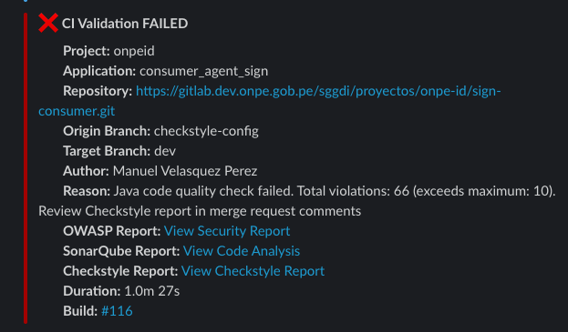
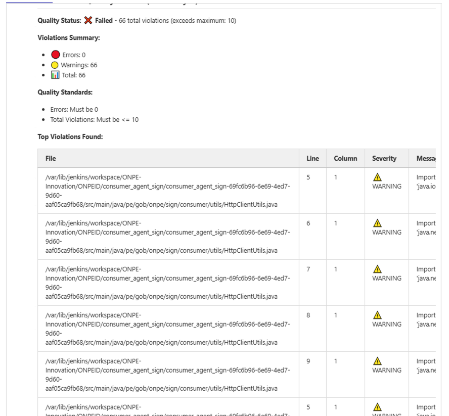

# SAST para Aplicaciones Java Maven - Flujo de CI

Este documento detalla el análisis estático de seguridad (SAST - Static Application Security Testing) implementado para aplicaciones Java Maven en el pipeline de CI/CD.

## Tabla de Contenidos

- [1. Code Style Check - Checkstyle](#1-code-style-check---checkstyle)

---

## 1. Code Style Check - Checkstyle

**Descripción**: Checkstyle es una herramienta de desarrollo que ayuda a los programadores a escribir código Java que se adhiere a un estándar de codificación. Automatiza el proceso de verificar el código Java para liberar a los desarrolladores de esta tarea.

**Propósito**: Mantener la calidad del código, detectar violaciones de estándares de codificación y garantizar la consistencia en todo el proyecto.

**Qué detecta**:
- Violaciones de convenciones de nombres (clases, métodos, variables)
- Problemas de formato e indentación
- Importaciones no utilizadas o desordenadas
- Uso incorrecto de espacios en blanco
- Comentarios Javadoc faltantes o incorrectos
- Complejidad ciclomática excesiva
- Longitud excesiva de líneas, métodos o clases
- Problemas de diseño y mejores prácticas de Java

### 1.1 Instalación

Para configurar Checkstyle en tu proyecto Maven, debes agregar el plugin en el archivo `pom.xml` y el archivo de configuración de reglas `checkstyle.xml` en la raíz del proyecto.

**Configuración del plugin en pom.xml:**

```xml
<build>
    <plugins>
        <plugin>
            <groupId>org.apache.maven.plugins</groupId>
            <artifactId>maven-checkstyle-plugin</artifactId>
            <version>3.6.0</version>
            <configuration>
                <configLocation>checkstyle.xml</configLocation>
                <consoleOutput>true</consoleOutput>
                <failsOnError>false</failsOnError>
                <linkXRef>false</linkXRef>
            </configuration>
            <dependencies>
                <dependency>
                    <groupId>com.puppycrawl.tools</groupId>
                    <artifactId>checkstyle</artifactId>
                    <version>10.26.1</version>
                </dependency>
            </dependencies>
        </plugin>
    </plugins>
</build>
```

**Archivo de configuración checkstyle.xml:**

El archivo `checkstyle.xml` contiene las reglas de estilo que se aplicarán al código.

Puedes utilizar como referencia el [checkstyle.xml](./checkstyle.xml) de este repositorio, que ya cuenta con las configuraciones necesarias.

El archivo incluye:
- Configuración de Checker para verificación de archivos
- Reglas de formato (espacios, indentación, longitud de línea)
- Convenciones de nombres para clases, métodos y variables
- Reglas de importaciones y organización de código
- Verificación de Javadoc y comentarios
- Detección de complejidad ciclomática
- Validación de mejores prácticas de Java

**Elementos clave de la configuración del plugin:**
- **configLocation**: Ubicación del archivo de reglas checkstyle.xml
- **failsOnError**: Configurado en false para generar reportes, pero el pipeline falla si hay **cualquier violación**
- **consoleOutput**: Muestra los resultados en la consola
- **dependencies**: Versión específica de Checkstyle a utilizar (10.26.1)

**Regla estricta**: El pipeline rechaza cualquier código con violaciones de Checkstyle. Si existe al menos una violación, el build fallará.

### 1.2 Ejecutar Pruebas

Para ejecutar Checkstyle localmente en tu proyecto Maven:

```bash
# Verificar el código con Checkstyle
mvn checkstyle:check

# Generar un reporte de Checkstyle (sin fallar el build)
mvn checkstyle:checkstyle

# Ejecutar como parte de la fase de validación
mvn validate

# Ver el reporte HTML generado
# El reporte se encuentra en: target/site/checkstyle.html
```

**Opciones útiles:**

```bash
# Ejecutar Checkstyle solo en archivos modificados
mvn checkstyle:check -Dcheckstyle.includes=**/*.java

# Ejecutar con un nivel de severidad específico
mvn checkstyle:check -Dcheckstyle.violationSeverity=warning

# Omitir la verificación de Checkstyle (no recomendado)
mvn clean install -Dcheckstyle.skip=true
```

#### Auto-corrección de violaciones

**Importante**: El plugin maven-checkstyle-plugin **NO tiene capacidad de auto-corrección**. Solo detecta y reporta violaciones.

**Solución: OpenRewrite**

Para corregir automáticamente violaciones de Checkstyle, puedes usar [OpenRewrite](https://docs.openrewrite.org/running-recipes/popular-recipe-guides/automatically-fix-checkstyle-violations):

1. Agrega el plugin rewrite-maven-plugin a tu pom.xml:

```xml
<plugin>
    <groupId>org.openrewrite.maven</groupId>
    <artifactId>rewrite-maven-plugin</artifactId>
    <version>5.45.0</version>
    <configuration>
        <activeRecipes>
            <recipe>org.openrewrite.java.cleanup.Cleanup</recipe>
        </activeRecipes>
    </configuration>
</plugin>
```

2. Ejecuta OpenRewrite para aplicar correcciones automáticas:

```bash
# Aplicar correcciones automáticamente
mvn rewrite:run

# Ver qué cambios se aplicarían (sin modificar archivos)
mvn rewrite:dryRun
```

**Alternativas en IDEs:**

- **IntelliJ IDEA**: Instala el plugin CheckStyle-IDEA, importa las reglas y usa `Ctrl+Alt+L` para reformatear
- **Eclipse**: Usa Eclipse-CS para corregir algunas violaciones automáticamente

**Nota**: No todas las reglas de Checkstyle pueden corregirse automáticamente. Algunas violaciones requieren intervención manual.

### 1.3 Check de Resultados

Si en las notificaciones obtienes una respuesta como esta:



Es porque falló la ejecución del análisis de Checkstyle. El pipeline aplica las siguientes reglas de calidad:

**Estándares de Calidad:**
- **Errores**: Deben ser 0
- **Total de Violaciones**: Debe ser <= 10

**Ejemplo de resultado fallido:**
```
Quality Status: Failed - 66 total violations (exceeds maximum: 10)
Violations Summary:
  Errors: 0
  Warnings: 66
  Total: 66
```

Para identificar los problemas:

1. **Verificar el detalle en el Merge Request**: Puedes ver un resumen de las violaciones directamente en los comentarios del MR:

   

2. **Descargar el reporte desde los artefactos**: Revisa los artefactos generados durante la ejecución del pipeline y descarga el archivo `checkstyle-report.html`

3. **Analizar el reporte HTML**: El archivo `checkstyle-report.html` contiene:
   - Ubicación exacta de cada violación (archivo y línea)
   - Descripción del problema
   - Severidad del issue (Error o Warning)
   - Regla de Checkstyle violada
   - Resumen estadístico por archivo y por tipo de violación

**Interpretación de resultados:**

- Si el **total de violaciones > 10**: El pipeline falla automáticamente
- Si hay **errores > 0**: El pipeline falla automáticamente
- Los **warnings** cuentan para el total de violaciones

**Recomendaciones:**

1. Ejecuta `mvn checkstyle:check` localmente antes de hacer commit
2. Revisa el reporte HTML en `target/site/checkstyle.html` para ver detalles
3. Usa OpenRewrite (`mvn rewrite:run`) para corregir automáticamente las violaciones que sea posible
4. Corrige manualmente las violaciones que requieran intervención humana
5. Verifica que el total de violaciones esté dentro del límite permitido (≤ 10)

---
