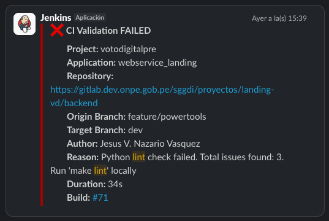

# SAST para Aplicaciones Python - Flujo de CI

Este documento detalla los 3 bloques de analisis estatico de seguridad (SAST - Static Application Security Testing) implementados para aplicaciones Python en el pipeline de CI/CD.

## Tabla de Contenidos

- [1. Lint Check - Ruff](#1-lint-check---ruff)
- [2. Security Check - Bandit](#2-security-check---bandit)
- [3. Dependency Security - Safety](#3-dependency-security---safety)

---

## 1. Lint Check - Ruff

**Descripción**: Ruff es un linter extremadamente rápido para Python, escrito en Rust. Combina la funcionalidad de múltiples herramientas (Flake8, isort, pydocstyle, etc.) en una sola.

**Propósito**: Mantener la calidad del código, detectar errores de sintaxis y garantizar el cumplimiento de estándares de codificación.

**Qué detecta**:
- Errores de sintaxis y lógica básica
- Importaciones no utilizadas o mal organizadas
- Variables no utilizadas
- Complejidad ciclomática excesiva
- Violaciones de PEP 8 y mejores prácticas de Python

### 1.1 Instalación

Para configurar Ruff en tu proyecto, debes agregar el archivo `pyproject.toml` en la raíz del proyecto.

Puedes utilizar como referencia el [pyproject.toml](./pyproject.toml) de este repositorio, que ya cuenta con las configuraciones necesarias.

El archivo incluye:
- Reglas de linting habilitadas
- Exclusiones de directorios
- Longitud máxima de línea
- Configuraciones específicas para el proyecto

### 1.2 Ejecutar Pruebas

Para facilitar la ejecución de Ruff, se debe agregar un archivo `Makefile` en la raíz del proyecto.

Puedes utilizar como referencia el [Makefile](./Makefile) de este repositorio, que ya cuenta con las configuraciones necesarias.

Con el Makefile configurado, puedes ejecutar:

```bash
# Ejecutar lint usando el Makefile
make lint
```

Alternativamente, puedes ejecutar Ruff directamente:

```bash
# Instalar Ruff (si no está instalado)
pip install ruff

# Ejecutar el análisis en todo el proyecto
ruff check .

# Ejecutar con autofix para problemas que se pueden corregir automáticamente
ruff check . --fix

# Verificar solo archivos específicos
ruff check path/to/file.py
```

### 1.3 Check de Resultados

Si en las notificaciones obtienes una respuesta como esta:



Es porque falló la ejecución del análisis de Ruff. Para identificar los problemas:

1. **Verificar los artefactos del pipeline**: Revisa los artefactos generados durante la ejecución del pipeline
2. **Ubicar el reporte**: Busca el archivo `gl-code-quality-report.json` en los artefactos
3. **Analizar errores**: Este archivo JSON contiene el detalle de todos los errores y warnings encontrados por Ruff

El archivo `gl-code-quality-report.json` sigue el formato estándar de GitLab Code Quality y contiene:
- Ubicación exacta de cada error (archivo y línea)
- Descripción del problema
- Severidad del issue
- Código de la regla violada

**Ejemplo de un error en el reporte:**

```json
{
  "check_name": "I001",
  "description": "I001: Import block is un-sorted or un-formatted",
  "severity": "major",
  "fingerprint": "a1e2471a3a7155ea",
  "location": {
    "path": "flask-server.py",
    "positions": {
      "begin": {
        "line": 1,
        "column": 1
      },
      "end": {
        "line": 16,
        "column": 46
      }
    }
  }
}
```

---

## 2. Security Check - Bandit

**Descripción**: Bandit es una herramienta diseñada específicamente para encontrar problemas comunes de seguridad en código Python.

**Propósito**: Identificar vulnerabilidades de seguridad y patrones de código inseguros antes de que lleguen a producción.

**Qué detecta**:
- Uso de funciones inseguras (eval, exec, pickle)
- Manejo inadecuado de secretos y credenciales
- Inyección SQL y command injection
- Problemas de criptografía débil
- Configuraciones inseguras de SSL/TLS
- Path traversal y otros problemas de seguridad comunes

---

## 3. Dependency Security - Safety

**Descripción**: Safety verifica las dependencias del proyecto contra bases de datos de vulnerabilidades conocidas (CVE).

**Propósito**: Asegurar que las librerías de terceros utilizadas no contengan vulnerabilidades de seguridad conocidas.

**Qué detecta**:
- Paquetes con vulnerabilidades CVE conocidas
- Versiones obsoletas con parches de seguridad disponibles
- Dependencias con niveles críticos de severidad
- Alertas de seguridad de la comunidad Python

---
